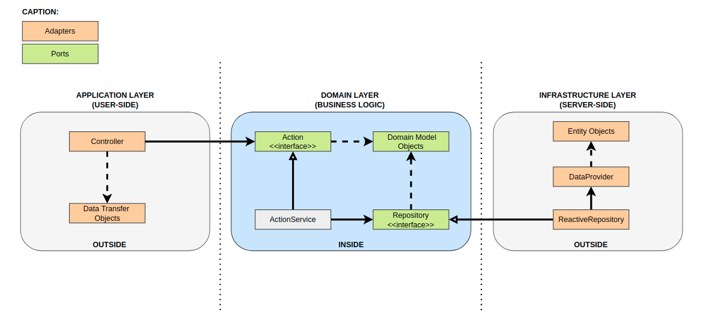
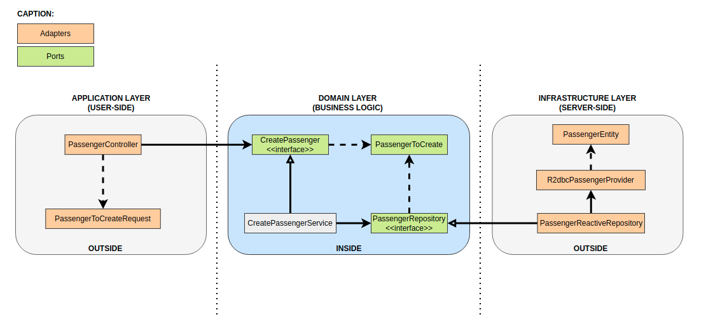

# Kotlin Spring REST API Sample
The project consists of creating, in the REST standard, an API sample to make travel requests, based on hexagonal architecture and non-blocking (async) request processing (Reactive Programming) with the resources that allow the following functionalities:

* CRUD (Create, Read, Update, Delete) for drivers
* CRUD (Create, Read, Update, Delete) for passengers
* Travel request creation
* Driver find available travel requests
* Driver accept travel request
* Driver refuse travel request

## About The Project
This is a test project to understand the work joining Kotlin, Spring, Spring WebFlux and R2DBC.
The purpose of this API is to store driver and passenger data, making it possible to query available trips and providing endpoints to accept or reject a travel.
This project also proposes to practice test pyramid concepts and understand how important it is for the life cycle of a software project.

### Key Features
* Travel requests
* CRUD
* Kotlin
* Spring
* WebFlux
* R2DBC
* Tests (unit, integration, components/end-to-end)
* Containers
* Hexagonal architecture

### Hexagonal Architecture Principles
Firstly, we should define principles to divide our code. As explained briefly already, hexagonal architecture defines the inside and the outside part.
What we'll do instead is divide our application into three layers: application (outside), domain (inside), and infrastructure (outside):



Through the application layer, the user or any other program interacts with the application. This area should contain things like user interfaces, RESTful controllers, and JSON serialization libraries. It includes anything that exposes entry to our application and orchestrates the execution of domain logic.
In the domain layer, we keep the code that touches and implements business logic. This is the core of our application. Additionally, this layer should be isolated from both the application part and the infrastructure part. On top of that, it should also contain interfaces that define the API to communicate with external parts, like the database, which the domain interacts with.
Lastly, the infrastructure layer is the part that contains anything that the application needs to work such as database configuration or Spring configuration. Besides, it also implements infrastructure-dependent interfaces from the domain layer.

To make it easier, let's see a perspective of the feature of creating a passenger:



### Blocking vs non-blocking (async) request processing
In traditional MVC applications, when a request come to server, a servlet thread is created. It delegates the request to worker threads for I/O operations such as database access etc. During the time worker threads are busy, servlet thread (request thread) remain in waiting status and thus it is blocked.

In non-blocking or asynchronous request processing, no thread is in waiting state. There is generally only one request thread receiving the request.
All incoming requests come with a event handler and call back information. Request thread delegates the incoming requests to a thread pool (generally small number of threads) which delegate the request to it’s handler function and immediately start processing other incoming requests from request thread.

### API Documentation
The project is documented by springdoc-openapi-ui, so just access the following address:
```
http://localhost:8080/travels-api/swagger-ui.html
```

### Built With
* [IntelliJ IDEA](https://www.jetbrains.com/pt-br/idea/) - The IDE used
* [Java 8](https://www.java.com/pt-BR/) - Execution platform
* [Spring Boot - 2.6.2](https://spring.io/projects/spring-boot) - Spring Boot makes it easy to create stand-alone, production-grade Spring based Applications that you can "just run"
* [PostgreSQL](https://www.postgresql.org/) - The database used
* [Kotlin](https://kotlinlang.org/) - Language
* [JUnit](https://junit.org/junit5/) - Unit and integration tests
* [SpringMockK](https://github.com/Ninja-Squad/springmockk) - Support for Spring Boot integration tests written in Kotlin using MockK instead of Mockito
* [Docker](https://www.docker.com/) - Operating system-level virtualization.
* [H2 Database](https://www.h2database.com/html/main.html) - In memory database for integration tests
* [Mockito](https://site.mockito.org/) - Tasty mocking framework for unit tests
* [Spring Doc Open API](https://springdoc.org/) - Library helps to automate the generation of API documentation using spring boot projects
* [Hexagonal Architecture](https://blog.octo.com/en/hexagonal-architecture-three-principles-and-an-implementation-example/) - Allow an application to equally be driven by users, programs, automated test or batch scripts
* [Spring WebFlux](https://docs.spring.io/spring-framework/docs/current/reference/html/web-reactive.html#webflux) - It is fully non-blocking, supports Reactive Streams back pressure, and runs on such servers as Netty, Undertow, and Servlet 3.1+ containers
* [R2DBC](https://r2dbc.io/) - The Reactive Relational Database Connectivity (R2DBC) project brings reactive programming APIs to relational databases.

## Getting Started
To get a local copy up and running follow these simple steps.

### Prerequisites
This project requires Java 8 or higher and use an IDE of your choice that supports Maven.

### Installation
Clone the repo
```
git clone https://github.com/ezequieljuliano/kotlin-spring-webflux-r2dbc-api-sample.git
```

## Usage
Open the project in your preferred IDE and run the main class **TravelsApplication** and use Postman to call the resources.

## Usage with Docker
Execute the command below in the terminal to generate the application's artifact and build the application's docker image:
```
mvn clean package dockerfile:build
```
Now execute:
```
docker-compose up
```

### Junit Tests
Run the unit tests and check that everything is fine.
Unit tests, integration tests and components/end-to-end tests were implemented.

## Contributing

Contributions are what make the open source community such an amazing place to be learn, inspire, and create. Any contributions you make are **greatly appreciated**.

1. Fork the Project
2. Create your Feature Branch (`git checkout -b feature/AmazingFeature`)
3. Commit your Changes (`git commit -m 'Add some AmazingFeature'`)
4. Push to the Branch (`git push origin feature/AmazingFeature`)
5. Open a Pull Request

## Contact

To contact us use the options:
* E-mail  : ezequieljuliano@gmail.com
* Twitter : [@ezequieljuliano](https://twitter.com/ezequieljuliano)
* Linkedin: [ezequiel-juliano-müller](https://www.linkedin.com/in/ezequiel-juliano-müller-43988a4a)